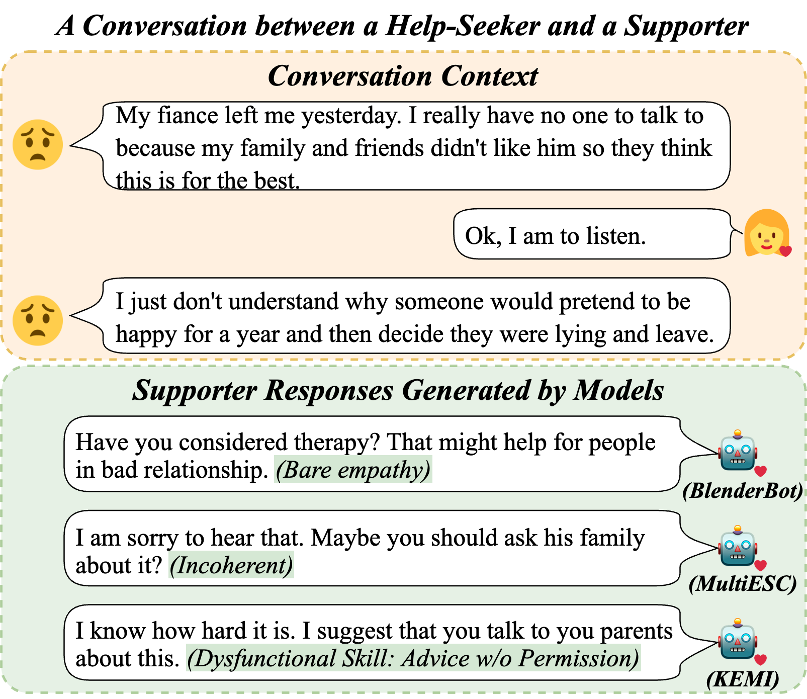
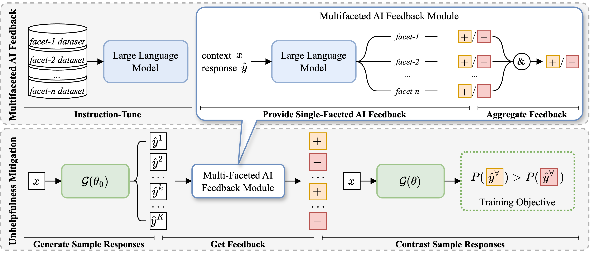

## Mitigating Unhelpfulness in Emotional Support Conversations with Multifaceted AI Feedback
[](https://opensource.org/licenses/MIT) 


This is the PyTorch implementation of the paper:

[**Mitigating Unhelpfulness in Emotional Support Conversations with Multifaceted AI Feedback**](https://arxiv.org/pdf/2401.05928). 

[Jiashuo WANG](http://www4.comp.polyu.edu.hk/~csjwang/), Chunpu Xu, Chak Tou Leong, [Wenjie LI](https://www4.comp.polyu.edu.hk/~cswjli/), Jing Li, ACL 2024


If you use our codes or your research is related to our work, please kindly cite our paper:

```bib
@inproceedings{wang2024mitigating,
  title={Mitigating Unhelpfulness in Emotional Support Conversations with Multifaceted AI Feedback},
  author={Wang, Jiashuo and Xu, Chunpu and Leong, Chak Tou and Li, Wenjie and Li, Jing},
  booktitle={Findings of the Association for Computational Linguistics: EMNLP 2022},
  year={2024}
}
```


## Abstract
Emotional support conversation systems are designed to alleviate users’ emotional distress and assist them in overcoming their challenges.
While previous studies have made progress, their models occasionally generate unhelpful responses, which are intended to be supportive but instead have counterproductive effects.
Since unhelpful responses can hinder the effectiveness of emotional support, it is crucial to mitigate them within conversations. Our solution is motivated by two principal considerations: 
(1) multiple facets of emotional support are expected to be considered when developing emotional support conversation models, and (2) directly reducing the probability
of generating unhelpful responses can effectively mitigate their occurrence. Accordingly, we introduce a novel model-agnostic framework named Mitigating unhelpfulness with multifaceted AI feedback for emotional support (Muffin). It first employs a multifaceted AI
feedback module designed to assess the helpfulness model responses across various facets of emotional support. Leveraging contrastive learning, Muffin then reduces the unhelpful
responses’ likelihoods. To validate the effectiveness of our proposed framework, we apply Muffin to various previous emotional support generation models, including the state-ofthe-art. Experimental results demonstrate that
Muffin can significantly mitigate unhelpful response generation while enhancing response fluency and relevance

<p align="center">

</p>

## Model Architecture:
<p align="center">

</p>

## Preparing Environment
```bash
conda env create -f env.yml -n muffin
conda activate muffin
```

## Experiments
### AI feedback model training
Refer to the [reward_model](./reward_model) folder for more details.

### Calibration
We tested Muffin on five different models.

For Vanilla and Joint, refer to [ESConv](./ESConv) folder, [KEMI](./KEMI) folder for KEMI, [MultiESC](./MultiESC) folder for MultiESC, and [TransESC](./TransESC) folder for TransESC.

